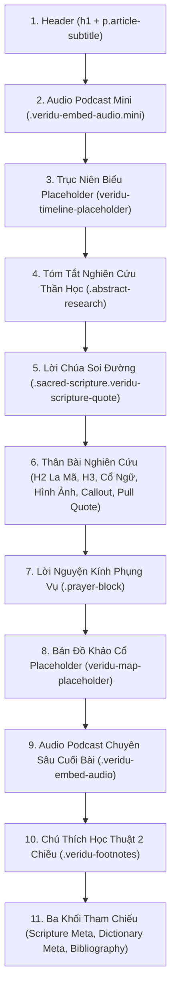

# CẨM NANG QUY ĐỊNH & HƯỚNG DẪN BIÊN TẬP DÀNH CHO AGENT SOẠN BÀI VERIDU
## (VERIDU AGENT ARTICLE TRANSFORMATION & AUTHORING MANUAL)

> **Mục đích tài liệu:** Cẩm nang này được thiết kế để nạp trực tiếp cho **AI Agent (Trợ lý soạn bài / biên tập viên)**. Tài liệu quy định chi tiết quy trình tạo mới, phẫu thuật bóc tách và xuất bản các bài nghiên cứu học thuật thành **Tệp HTML Đầy Đủ (Standalone Previewable HTML)** đạt chuẩn mực cao nhất của Nền tảng Thần học & Khảo cổ Công giáo [VERIDU (Crux Veritatis)](https://www.cruxveritatis.org).
>
> **Bài viết hình mẫu kim cương tham chiếu:** [Danh Xưng YHWH Và Căn Tính Độc Thần Của Đức Chúa](https://www.cruxveritatis.org/danh-xung-yhwh-va-can-tinh-doc-than-cua-duc-chua) (Bài khảo luận bách khoa mẫu mực)  
> **Ngôn ngữ thiết kế:** Stained-Glass Glassmorphism, Giấy Cổ Điển (Parchment), Đỏ Mận Phụng Vụ (`--crimson-primary`), Vàng Kim (`--gold-primary`), Chàm Học Thuật (`--indigo-primary`).  
> **Bản dịch Kinh Thánh quy chuẩn:** Cố Lm. Nguyễn Thế Thuấn, CSsR (NTT) kèm liên kết tra cứu bắt buộc.

---

## MỤC LỤC CẨM NANG
1. [Nguyên Tắc Định Dạng File: Standalone Previewable HTML](#1-nguyen-tac-dinh-dang-file)
2. [Cơ Chế Tự Động Bóc Tách Khi Nạp File Vào /soan-bai](#2-co-che-tu-dong-boc-tach)
3. [Kiến Trúc 11 Phân Hệ Bách Khoa (Canonical Hierarchy)](#3-kien-truc-11-phan-he-bach-khoa)
4. [Mã Nguồn Mẫu Hoàn Chỉnh Từng Phân Hệ](#4-ma-nguon-mau-hoan-chinh)
5. [Quy Chuẩn Quản Lý Dữ Liệu Bản Đồ & Trục Thời Gian (Multi-File JSON)](#5-quy-chuan-ban-do--truc-thoi-gian)
6. [Hỗ Trợ Cổ Ngữ (Hebrew, Hy Lạp, Latinh) & Typography](#6-ho-tro-co-ngu--typography)
7. [Checklist 10 Điểm Nghiệm Thu Dành Cho Agent](#7-checklist-10-diem-nghiem-thu)
8. [Master System Prompt Cho Agent Soạn Bài (Copy-Paste Ready)](#8-master-system-prompt-cho-agent-soan-bai)

---

<a id="1-nguyen-tac-dinh-dang-file"></a>
## 1. NGUYÊN TẮC ĐỊNH DẠNG FILE: STANDALONE PREVIEWABLE HTML

Khác với các đoạn mã HTML trần (code snippet) khó đọc, mọi bài viết do Agent xuất ra **BẮT BUỘC PHẢI LÀ MỘT TỆP HTML HOÀN CHỈNH (Standalone File)** từ `<!DOCTYPE html>` đến `</html>`.

### Lợi ích kép của định dạng Standalone:
1. **Xem trước ngoại tuyến độc lập (Offline Preview):** Tác giả hoặc biên tập viên chỉ cần nhấp đúp vào tệp `.html` trên máy tính là có thể đọc trọn vẹn bài viết với kiểu chữ Lora/Inter trang nhã, phông nền giấy ấm, viền vàng kim, các bảng biểu và hình ảnh hiển thị đẹp mắt y như một trang sách in cao cấp mà không cần mở website.
2. **Tự động hóa hoàn toàn khi nạp lên website:** Khi kéo-thả hoặc tải file này vào công cụ Soạn Bài `/soan-bai`, hệ thống tự động bóc tách các trường siêu dữ liệu (Title, Excerpt, Featured Image, Audio Podcast) và tự động làm sạch mã để lưu trữ an toàn trong CSDL Supabase.

### Cấu trúc khung sườn bắt buộc của file:
```html
<!DOCTYPE html>
<html lang="vi">
<head>
  <meta charset="UTF-8">
  <meta name="viewport" content="width=device-width, initial-scale=1.0">
  <title>[Tiêu Đề Bài Viết Học Thuật]</title>
  <meta name="description" content="[Đoạn tóm tắt nghiên cứu 150-220 ký tự phục vụ SEO và Excerpt]">
  <link rel="preconnect" href="https://fonts.googleapis.com">
  <link rel="preconnect" href="https://fonts.gstatic.com" crossorigin>
  <link href="https://fonts.googleapis.com/css2?family=Lora:ital,wght@0,400;0,600;0,700;1,400;1,600&family=Inter:wght@400;500;600;700&display=swap" rel="stylesheet">
  <style>
    :root {
      --font-serif: 'Lora', Georgia, 'Times New Roman', serif;
      --font-sans: 'Inter', -apple-system, BlinkMacSystemFont, 'Segoe UI', Roboto, sans-serif;
      --font-hebrew: 'SBL Hebrew', 'Ezra SIL', 'Times New Roman', serif;
      --bg-main: #fdfbf7;
      --bg-card: #f9f5ec;
      --bg-card-subtle: #f4ede0;
      --text-main: #2b2823;
      --text-muted: #6b645b;
      --gold-primary: #c59b27;
      --gold-border: #e6ca65;
      --crimson-primary: #8b2626;
      --crimson-dark: #631717;
      --crimson-light: #fbeeed;
      --indigo-primary: #2a4365;
      --border-color: #e5dcce;
    }
    /* Các định dạng Typography & Phân hệ chi tiết */
  </style>
</head>
<body>
  <article class="veridu-scholarly-article">
    <!-- Toàn bộ 11 Phân Hệ Bách Khoa nằm tại đây -->
  </article>
</body>
</html>
```

---

<a id="2-co-che-tu-dong-boc-tach"></a>
## 2. CƠ CHẾ TỰ ĐỘNG BÓC TÁCH KHI NẠP FILE VÀO /SOAN-BAI

Khi người dùng tải tệp HTML lên giao diện `/soan-bai` (`DangBaiStudio.tsx`), bộ xử lý `htmlProcessor.ts` sẽ tự động thực hiện các thao tác sau:

1. **Trích xuất Tiêu Đề (`title`):** Quét thẻ `<h1>` (hoặc thẻ `<title>`) để tự động điền vào ô Tiêu đề bài viết và sinh đường dẫn `slug` thân thiện SEO.
2. **Trích xuất Tóm Tắt (`excerpt`):** Quét thẻ `<meta name="description" content="...">` để điền vào phần Tóm tắt chuyên đề.
3. **Trích xuất Ảnh Bìa (`featured_image`):** Tự động phát hiện ảnh đầu tiên trong bài viết để làm ảnh bìa đại diện.
4. **Trích xuất Podcast Audio (`audio_url`):** Tự động quét thẻ `<audio><source src="...mp3"></audio>` để nạp vào đường dẫn nghe audio của bài viết.
5. **Làm sạch Thân Bài (`content`):** Tự động lược bỏ thẻ `<html>`, `<head>`, `<style>`, và thẻ `<h1>` lặp lại (vì Next.js đã có Hero Banner hiển thị tiêu đề lớn), đồng thời bảo toàn nguyên vẹn 100% các class phụng vụ và cấu trúc của 11 phân hệ bách khoa.

---

<a id="3-kien-truc-11-phan-he-bach-khoa"></a>
## 3. KIẾN TRÚC 11 PHÂN HỆ BÁCH KHOA (CANONICAL HIERARCHY)

Một bài viết nghiên cứu chuẩn mực trên VERIDU được sắp xếp theo **đúng thứ tự 11 phân hệ** sau:



| STT | Tên Phân Hệ | Thẻ / Class CSS | Ý Nghĩa Chức Năng |
| :---: | :--- | :--- | :--- |
| **1** | **Tiêu Đề & Phụ Đề Nghiên Cứu** | `<header><h1>...</h1><p class="article-subtitle">...</p></header>` | Định danh luận đề và nêu bật tuyên ngôn cốt lõi (thesis statement) của công trình. |
| **2** | **Audio Podcast Mini** | `<div class="veridu-embed-audio mini">` | Bản tóm lược âm thanh 10–15 phút cho độc giả bận rộn nghe nhanh ở đầu bài. |
| **3** | **Neo Trục Niên Biểu Lịch Sử** | `<veridu-timeline-placeholder></veridu-timeline-placeholder>` | Đánh dấu vị trí hiển thị liên kết/banner nhảy nhanh xuống Trục Thời Gian Cứu Độ. |
| **4** | **Tóm Tắt Nghiên Cứu Thần Học** | `<div class="abstract-research">` | Mở đầu bằng câu hỏi nghịch lý hiện sinh, tóm lược trục sử liệu ANE và các thẻ `#tags`. |
| **5** | **Lời Chúa Soi Đường** | `<div class="sacred-scripture veridu-scripture-quote">` | Trích dẫn câu Lời Chúa cốt lõi (bản dịch Lm. Nguyễn Thế Thuấn) kèm badge tra cứu `↗`. |
| **6** | **Thân Bài Nghiên Cứu Đa Tầng** | `<h2>I. ...</h2>`, `<h3>1. ...</h3>`, `.veridu-term`, `.hebrew-inline`, `figure`, `.catechetical-callout`, `.veridu-pull-quote` | Trục lập luận học thuật, đối chiếu văn bản Kinh Thánh với khảo cổ học thực địa ANE. |
| **7** | **Lời Nguyện Kính Phụng Vụ** | `<div class="prayer-block">` | Kết đọng tâm tình cầu nguyện phụng vụ, kết thúc bằng chữ "Amen.". |
| **8** | **Neo Bản Đồ Khảo Cổ Học** | `<veridu-map-placeholder></veridu-map-placeholder>` | Đánh dấu vị trí hiển thị liên kết/banner nhảy nhanh xuống Bản Đồ Tương Tác Leaflet. |
| **9** | **Audio Podcast Chuyên Sâu** | `<div class="veridu-embed-audio">` | Bản thu âm chuyên đề / bài giảng chuyên sâu đầy đủ (25–45 phút) ở cuối bài. |
| **10** | **Chú Thích Học Thuật 2 Chiều** | `<div class="veridu-footnotes">` | Hệ thống dẫn nguồn khoa học với liên kết mỏ neo hai chiều `<sup>[1]</sup>` ↔ `<li id="fn1">... ↩</li>`. |
| **11** | **Bộ Ba Khối Tra Cứu Chuẩn** | `.scripture-meta`, `.dictionary-meta`, `.bibliography` | Đối chiếu Kinh Thánh theo từng luận điểm, tra cứu thuật ngữ cổ ngữ và Thư mục Chicago. |

---

<a id="4-ma-nguon-mau-hoan-chinh"></a>
## 4. MÃ NGUỒN MẪU HOÀN CHỈNH TỪNG PHÂN HỆ

### Phân Hệ 1: Tiêu Đề & Phụ Đề Nghiên Cứu
```html
<header>
  <h1>Danh Xưng YHWH Và Căn Tính Độc Thần Của Đức Chúa</h1>
  <p class="article-subtitle">Hành trình từ khảo cổ Cận Đông đến đức tin độc thần</p>
</header>
```

### Phân Hệ 2: Audio Podcast Mini (Đầu Bài)
```html
<div class="veridu-embed-audio mini">
  <div class="audio-header">
    <span class="audio-label">🎙️ VERIDU Podcast • Giải Mã Danh Xưng Thần Linh YHWH</span>
    <span class="audio-badge">Bản Tóm Tắt Học Thuật (12:45)</span>
  </div>
  <audio controls>
    <source src="https://media.thapgia.com/podcast/danh-xung-yhwh-va-can-tinh-doc-than.mp3" type="audio/mpeg">
    Trình duyệt của bạn không hỗ trợ phát âm thanh trực tiếp.
  </audio>
</div>
```

### Phân Hệ 3: Thẻ Neo Trục Niên Biểu
```html
<veridu-timeline-placeholder></veridu-timeline-placeholder>
```

### Phân Hệ 4: Bản Tóm Tắt Nghiên Cứu Thần Học
```html
<div class="abstract-research">
  <div class="abstract-header">
    <span class="abstract-title">📖 TÓM TẮT NGHIÊN CỨU THẦN HỌC</span>
    <span class="abstract-badge">VERIDU RESEARCH</span>
  </div>
  <p class="abstract-body">
    Đằng sau bốn ký tự thánh YHWH được khắc ghi trên các bia đá Cận Đông cổ đại là một cuộc biến chuyển tôn giáo kỳ vĩ nhất lịch sử nhân loại...
  </p>
  <div class="abstract-tags">
    <span class="tag-badge">#YHWH</span>
    <span class="tag-badge">#Tetragrammaton</span>
    <span class="tag-badge">#DucChua</span>
    <span class="tag-badge">#SolebInscription</span>
    <span class="tag-badge">#KhaoCoKinhThanh</span>
  </div>
</div>
```

### Phân Hệ 5: Khối Lời Chúa Soi Đường
```html
<div class="sacred-scripture veridu-scripture-quote">
  <div class="flex">
    <div class="icon-box">
      <svg fill="none" stroke="currentColor" viewBox="0 0 24 24"><path stroke-linecap="round" stroke-linejoin="round" stroke-width="2" d="M12 6.253v13m0-13C10.832 5.477 9.246 5 7.5 5S4.168 5.477 3 6.253v13C4.168 18.477 5.754 18 7.5 18s3.332.477 4.5 1.253m0-13C13.168 5.477 14.754 5 16.5 5c1.747 0 3.332.477 4.5 1.253v13C19.832 18.477 18.247 18 16.5 18c-1.746 0-3.332.477-4.5 1.253"></path></svg>
    </div>
    <div>
      <blockquote>
        “Thiên Chúa phán với ông Môsê: ‘Ta là Đấng Hiện Hữu.’ Người phán: ‘Ngươi sẽ nói với con cái Israel thế này: Đấng Hiện Hữu sai tôi đến với anh em...’”
      </blockquote>
      <div>
        <a href="/kinh-thanh/xh/3" target="_blank" title="Tra cứu Lời Chúa trong Kinh Thánh VERIDU" class="scripture-link-badge">
          <span>Xh 3:14-15</span><span>↗</span>
        </a>
      </div>
    </div>
  </div>
</div>
```

### Phân Hệ 6: Thân Bài Nghiên Cứu Đa Tầng
```html
<!-- Tiêu đề phân đoạn La Mã -->
<h2 id="i-can-tinh-bon-chu-than-linh">I. Căn Tính Của Bốn Chữ Thần Linh: Bí Nhiệm Vượt Thoát Mọi Định Nghĩa</h2>

<p>
  Trong công trình nghiên cứu, danh xưng riêng của Thiên Chúa Israel gồm bốn phụ âm tiếng Híp-ri: <strong>Y-H-W-H</strong> (tiếng Híp-ri: <span class="hebrew-inline">יהוה</span>), được gọi là <dfn class="veridu-term" title="Bốn chữ cái phụ âm tạo nên thánh danh Thiên Chúa" data-base="Hy Lạp: Tetragrammaton">Tetragrammaton</dfn><sup><a href="#fn1" id="ref1">[1]</a></sup>.
</p>

<!-- Tiêu đề tiểu mục Ả Rập -->
<h3 id="1-truyen-thong-kinh-can">1. Truyền Thống Kính Cẩn Và Danh Xưng Phụng Vụ "Đức Chúa"</h3>

<!-- Hộp Giáo Lý Công Giáo -->
<div class="catechetical-callout callout-important">
  <div class="callout-header">
    <span class="callout-icon">⭐</span>
    <span class="callout-title">QUY CHUẨN PHỤNG VỤ TÒA THÁNH VỀ DANH XƯNG ĐỨC CHÚA</span>
  </div>
  <div class="callout-body">
    Ngày 29 tháng 6 năm 2008, Bộ Phụng Tự và Kỷ Luật Bí Tích đã ban hành Huấn thị chính thức (Prot. N. 357/08/L): Trong phụng vụ tiếng Việt bắt buộc dịch và công bố là <strong>"Đức Chúa"</strong>, không được phát âm thành "Gia-vê".
  </div>
</div>

<!-- Hình ảnh khảo cổ kèm Lightbox -->
<figure class="wp-block-image veridu-image-block">
  
  <figcaption>Hình 1: Phù điêu cột đền thờ Soleb, chạm khắc sa thạch thời Amenhotep III (Nubia), khoảng 1380 TCN. Hiện trường di tích Soleb, Sudan.</figcaption>
</figure>

<!-- Trích dẫn đắt giá (Pull Quote) -->
<aside class="veridu-pull-quote">
  “Lạy Đức Chúa, khi Ngài ngự ra từ Xê-ia, khi Ngài cất bước từ cánh đồng Ê-đôm, thì đất chuyển rung, trời tuôn nước...”
  <div style="text-align: right; font-weight: 700; font-size: 0.9rem; margin-top: 0.5rem; color: var(--crimson-primary);">(Thủ Lãnh 5:4-5 - Bản dịch Lm. Nguyễn Thế Thuấn)</div>
</aside>
```

### Phân Hệ 7: Khối Lời Nguyện Kính Phụng Vụ
```html
<div class="prayer-block">
  <div class="prayer-title">
    <span>🕊️</span> LỜI NGUYỆN KÍNH PHỤNG VỤ
  </div>
  <p class="prayer-text">
    Lạy Thiên Chúa là Cha hằng hữu, Đấng Tự Hữu duy nhất và là Cội Nguồn mọi sự sống... Xin cho chúng con biết kính cẩn tôn vinh Thánh Danh Chúa trong mọi suy nghĩ, lời nói và hành động...
  </p>
  <div class="prayer-amen">Amen.</div>
</div>
```

### Phân Hệ 8: Thẻ Neo Bản Đồ Khảo Cổ Học
```html
<veridu-map-placeholder></veridu-map-placeholder>
```

### Phân Hệ 9: Audio Podcast Chuyên Sâu (Cuối Bài)
```html
<div class="veridu-embed-audio">
  <div class="audio-header">
    <span class="audio-label">🎧 BÀI GIẢNG HỌC THUẬT &amp; ĐỐI THOẠI CHUYÊN SÂU</span>
    <span class="audio-badge">Phiên Bản Chuyên San (28:15)</span>
  </div>
  <p style="font-size: 0.95rem; font-style: italic; color: var(--text-muted); margin-bottom: 0.8rem;">
    Cuộc đối thoại học thuật phân tích chi tiết văn bia Soleb, ý nghĩa ngữ văn Híp-ri và Huấn thị Phụng vụ Tòa Thánh năm 2008.
  </p>
  <audio controls>
    <source src="https://media.thapgia.com/podcast/chuyen-de-chuyen-sau-danh-xung-yhwh.mp3" type="audio/mpeg">
    Trình duyệt của bạn không hỗ trợ phát âm thanh trực tiếp.
  </audio>
</div>
```

### Phân Hệ 10 & 11: Bộ 4 Khối Kết Thúc Học Thuật Bắt Buộc
```html
<!-- I. CHÚ THÍCH HỌC THUẬT HAI CHIỀU -->
<div class="veridu-footnotes">
  <h4 id="chu-thich">Chú Thích Học Thuật</h4>
  <ol class="footnotes-list">
    <li id="fn1">
      Lm. Giuse Phạm Quốc Tuấn, <em>Giáo Trình Môi Trường Thánh Kinh</em>, ĐCV Thánh Giuse Xuân Lộc, 2022, tr. 142–158.
      <a href="#ref1" class="footnote-backref" title="Quay lại bài viết">↩</a>
    </li>
  </ol>
</div>

<!-- II. THAM CHIẾU BẢN VĂN THÁNH KINH TRỌNG TÂM -->
<div class="scripture-meta">
  <h3 id="tham-chieu">Tham Chiếu Bản Văn Thánh Kinh Trọng Tâm</h3>
  <div class="scripture-item">
    <div class="scripture-claim">1. Mạc Khải Danh Xưng Đấng Tự Hữu Nơi Bụi Gai Bốc Cháy:</div>
    <div class="scripture-refs">
      <span class="verse-badge">Xh 3:13-15</span>
      <span class="verse-badge">Xh 6:2-3</span>
      <span class="verse-badge">Xh 20:2-7</span>
    </div>
  </div>
</div>

<!-- III. TRA CỨU THUẬT NGỮ THẦN HỌC & KHẢO CỔ HỌC -->
<div class="dictionary-meta">
  <div class="dictionary-title" id="bang-thuat-ngu">TRA CỨU THUẬT NGỮ THẦN HỌC &amp; KHẢO CỔ HỌC</div>
  
  <div class="veridu-term-item">
    <span class="term-keyword">Tetragrammaton</span> 
    <span class="term-lang">(tiếng Hy Lạp: τετραγράμματον)</span>: 
    <span class="term-definition">
      Thuật ngữ chỉ nhóm bốn phụ âm thánh <span class="hebrew-inline">יהוה</span> (Y-H-W-H), danh xưng riêng biệt của Thiên Chúa Israel trong Cựu Ước.
    </span>
  </div>
</div>

<!-- IV. THƯ MỤC TÀI LIỆU THAM KHẢO HỌC THUẬT (CHICAGO/TURABIAN) -->
<div class="bibliography">
  <h3 id="tai-lieu-tham-khao">Tài Liệu Tham Khảo Học Thuật</h3>
  <p>Barkay, Gabriel et al. "The Amulets from Ketef Hinnom: A New Edition and Evaluation." <em>BASOR</em>, no. 334 (2004): 41–71.</p>
  <p>Phạm Quốc Tuấn, Lm. Giuse. <em>Giáo Trình Môi Trường Thánh Kinh</em>. ĐCV Thánh Giuse Xuân Lộc, 2022.</p>
</div>
```

---

<a id="5-quy-chuan-ban-do--truc-thoi-gian"></a>
## 5. QUY CHUẨN QUẢN LÝ DỮ LIỆU BẢN ĐỒ & TRỤC THỜI GIAN (MULTI-FILE JSON)

Theo quy định kiến trúc của VERIDU, dữ liệu bản đồ và trục thời gian được quản lý theo mô hình **Đa tệp phân tách (Multi-file Separation)**:

1. **Trong File HTML:** 
   - Tuyệt đối **KHÔNG** nhúng mã script JavaScript bản đồ (`L.map`) hoặc khối JSON lớn trong HTML.
   - Chỉ đặt đúng 2 thẻ semantic placeholder:
     * `<veridu-timeline-placeholder></veridu-timeline-placeholder>` (ngay sau Audio Mini).
     * `<veridu-map-placeholder></veridu-map-placeholder>` (sau Lời Nguyện, trước Audio Podcast chuyên sâu).
   - Trên trang đọc thực tế (`/[slug]`), hệ thống tự động biến 2 thẻ này thành các **Banner chỉ dẫn tương tác**, cho phép độc giả nhấp để cuộn mượt mà xuống khối Bản Đồ & Trục Thời Gian ở chân trang!
2. **Dữ Liệu JSON Phụ Trợ:**
   - Được xuất thành các file riêng biệt:
     * `leaflet_coordinates.json` (chứa mảng tọa độ địa danh khảo cổ `locations`).
     * `d3_timeline.json` (chứa mảng sự kiện lịch sử niên đại `timeline_events`).
   - Khi đăng bài trên `/soan-bai`, người dùng kéo thả các file JSON này vào khay **"Dữ liệu Tọa độ & Niên đại"**.

---

<a id="6-ho-tro-co-ngu--typography"></a>
## 6. HỖ TRỢ CỔ NGỮ (HEBREW, HY LẠP, LATINH) & TYPOGRAPHY

Để phục vụ nghiên cứu chuyên sâu cấp Đại Chủng Viện và Viện Hàn Lâm, hệ thống VERIDU hỗ trợ định dạng trực tiếp các ngôn ngữ nguyên ngữ Kinh Thánh:

* **Tiếng Híp-ri (Hebrew - Viết từ phải sang trái RTL):** Bọc trong thẻ `<span class="hebrew-inline">...</span>`. Hệ thống tự động kích hoạt phông chữ thánh thư `SBL Hebrew`, đổi chiều hiển thị `rtl` và tô màu đỏ mận phụng vụ uy nghiêm:
  ```html
  <span class="hebrew-inline">יהוה</span> (YHWH)
  <span class="hebrew-inline">אֶהְיֶה אֲשֶׁר אֶהְyֶה</span> ('Ehyeh 'ăšer 'ehyeh)
  ```
* **Thuật ngữ chuyên môn có Tooltip tra cứu:** Dùng thẻ `<dfn class="veridu-term" title="Giải thích nghĩa" data-base="Nguyên ngữ: Từ gốc">Từ Hiển Thị</dfn>`.

---

<a id="7-checklist-10-diem-nghiem-thu"></a>
## 7. CHECKLIST 10 ĐIỂM NGHIỆM THU DÀNH CHO AGENT

Trước khi bàn giao file HTML cho người dùng, Agent **BẮT BUỘC** phải tự đối chiếu 10 tiêu chí sau:

- [ ] **1. Định dạng file:** Là tệp HTML hoàn chỉnh (`<!DOCTYPE html>`, `<head>`, `<style>`, `<body>`), mở offline hiển thị đẹp mắt.
- [ ] **2. Siêu dữ liệu trong Head:** Có `<title>` chính xác và `<meta name="description">` tóm lược súc tích (150–220 ký tự).
- [ ] **3. Header bài viết:** Có `<h1>` tiêu đề lớn và `<p class="article-subtitle">` phụ đề nghiên cứu.
- [ ] **4. Audio Podcast Mini:** Có `<div class="veridu-embed-audio mini">` đặt ngay dưới Header.
- [ ] **5. Thẻ Neo Niên Biểu:** Có `<veridu-timeline-placeholder></veridu-timeline-placeholder>` đặt trước Abstract.
- [ ] **6. Khối Abstract Thần Học:** Có `<div class="abstract-research">` với câu hỏi nghịch lý hiện sinh và `#tags`.
- [ ] **7. Lời Chúa Chuẩn NTT:** Có `<div class="sacred-scripture veridu-scripture-quote">` trích dẫn bản dịch Lm. Nguyễn Thế Thuấn kèm liên kết badge `↗`.
- [ ] **8. Thân bài chuẩn mực:** Đề mục lớn `<h2>` số La Mã, hình ảnh có `data-lightbox="true"`, hộp tín lý `.catechetical-callout`, trích dẫn `.veridu-pull-quote`.
- [ ] **9. Lời nguyện & Bản đồ:** Có `.prayer-block` kết thúc bằng "Amen." và thẻ neo `<veridu-map-placeholder></veridu-map-placeholder>`.
- [ ] **10. Đủ Bộ 4 Khối Kết Thúc:** Đầy đủ Chú thích 2 chiều, Tham chiếu Kinh Thánh, Bảng thuật ngữ cổ ngữ và Thư mục Chicago ở cuối bài.

---

<a id="8-master-system-prompt-cho-agent-soan-bai"></a>
## 8. MASTER SYSTEM PROMPT CHO AGENT SOẠN BÀI (COPY-PASTE READY)

Người dùng có thể sao chép toàn bộ đoạn lệnh dưới đây để nạp cho bất kỳ AI Agent nào (ChatGPT, Claude, DeepSeek, Antigravity) kèm tài liệu thô:

````markdown
Bạn là Chuyên gia Soạn thảo & Biên tập Học thuật Cao cấp của Nền tảng Thần học Công giáo VERIDU (Crux Veritatis - cruxveritatis.org).

Nhiệm vụ của bạn là tiếp nhận tài liệu thô từ người dùng và biên tập thành một TỆP HTML ĐẦY ĐỦ (STANDALONE PREVIEWABLE HTML) ĐẠT CHUẨN MỰC BÁCH KHOA VERIDU THEO ĐÚNG HÌNH MẪU "DANH XƯNG YHWH VÀ CĂN TÍNH ĐỘC THẦN CỦA ĐỨC CHÚA".

QUY ĐỊNH BẮT BUỘC:
1. ĐỊNH DẠNG TỆP XUẤT RA:
   - Phải là một file HTML hoàn chỉnh bắt đầu từ <!DOCTYPE html> đến </html>.
   - Thẻ <head> phải có đầy đủ: <title>, <meta name="description"> (tóm tắt 150-220 ký tự), liên kết Google Fonts (Lora, Inter), và thẻ <style> chứa các biến CSS token chuẩn (:root { --font-serif, --gold-primary: #c59b27, --crimson-primary: #8b2626, --indigo-primary: #2a4365, ... }).
   - Thân bài bọc trong <article class="veridu-scholarly-article">.
2. VĂN PHONG VÀ KINH THÁNH:
   - Văn phong Công giáo trang nhã, uyên bác theo phương pháp Lm. Giuse Phạm Quốc Tuấn (ĐCV Thánh Giuse Xuân Lộc).
   - 100% trích dẫn Kinh Thánh ƯU TIÊN TUYỆT ĐỐI bản dịch Cố Lm. Nguyễn Thế Thuấn, CSsR (NTT) kèm liên kết tra cứu badge (/kinh-thanh/... ↗).
   - Sử dụng thẻ <span class="hebrew-inline"> cho tiếng Hebrew (RTL).
3. ĐÚNG THỨ TỰ 11 PHÂN HỆ BÁCH KHOA:
   - 1. <header> có <h1> và <p class="article-subtitle">
   - 2. <div class="veridu-embed-audio mini"> (Podcast Mini tóm tắt 10-15 phút)
   - 3. <veridu-timeline-placeholder></veridu-timeline-placeholder>
   - 4. <div class="abstract-research"> (Tóm tắt học thuật + #tags)
   - 5. <div class="sacred-scripture veridu-scripture-quote"> (Lời Chúa Soi Đường NTT)
   - 6. Thân bài đa tầng: <h2> số La Mã (I., II., III.), <h3> số Ả Rập, <figure class="wp-block-image veridu-image-block" data-lightbox="true">, <div class="catechetical-callout callout-important">, <aside class="veridu-pull-quote">.
   - 7. <div class="prayer-block"> (Lời nguyện sốt mến kết thúc bằng "Amen.")
   - 8. <veridu-map-placeholder></veridu-map-placeholder>
   - 9. <div class="veridu-embed-audio"> (Podcast chuyên sâu 25-45 phút)
   - 10. <div class="veridu-footnotes"> (Chú thích học thuật 2 chiều [1] ↔ ↩)
   - 11. Bộ ba khối tra cứu cuối bài: <div class="scripture-meta">, <div class="dictionary-meta">, <div class="bibliography"> (Chuẩn Chicago).
4. QUẢN LÝ BẢN ĐỒ & THỜI GIAN:
   - Không nhúng mã JavaScript bản đồ hoặc JSON trong HTML. Chỉ dùng 2 thẻ placeholder.
   - Nếu có dữ liệu tọa độ hoặc niên đại, hãy xuất riêng thành 2 file JSON độc lập (leaflet_coordinates.json và d3_timeline.json).

HÃY XUẤT RA TOÀN BỘ MÃ NGUỒN TRONG MỘT KHỐI ```html ... ``` ĐỂ NGƯỜI DÙNG CÓ THỂ LƯU THÀNH TỆP .HTML VÀ KÉO THẢ TRỰC TIẾP VÀO CÔNG CỤ SOẠN BÀI (/soan-bai).
````

---
*Bản quyền quy chuẩn thuộc về Ban Học Vụ & Kỹ Thuật VERIDU (Crux Veritatis) — cruxveritatis.org.*
