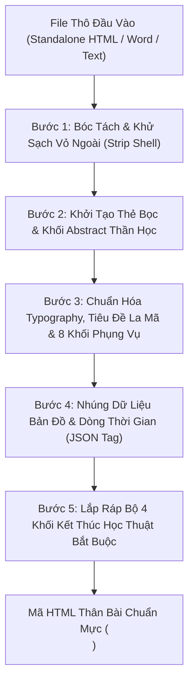

# CẨM NANG QUY ĐỊNH & HƯỚNG DẪN BIÊN TẬP DÀNH CHO AGENT SOẠN BÀI VERIDU
## (VERIDU AGENT ARTICLE TRANSFORMATION & AUTHORING MANUAL)

> **Mục đích tài liệu:** Cẩm nang này được thiết kế để nạp trực tiếp cho **AI Agent (Trợ lý soạn bài / biên tập viên)**. Tài liệu quy định chi tiết quy trình tiếp nhận, phẫu thuật bóc tách và chuyển đổi các file tài liệu thô, file HTML xuất từ bên thứ ba, tệp Word hoặc dữ liệu JSON thành **Mã HTML Thân Bài Chuẩn Mực** phục vụ xuất bản học thuật lâu dài, đồng bộ 100% trên nền tảng [VERIDU (Crux Veritatis)](https://www.cruxveritatis.org).
>
> **Bài viết hình mẫu tham chiếu:** [Vương Quốc Israel Cổ Đại — ID #48](https://www.cruxveritatis.org/vuong-quoc-israel-co-dai-khao-co-hoc-can-dong-buoc-ngoat-lich-su-va-hanh-trinh-duc-tin-doc-than)  
> **Ngôn ngữ thiết kế:** Stained-Glass Glassmorphism, Hổ phách Phụng vụ (Liturgical Amber), Tương thích Dark/Light Mode.  
> **Bản dịch Kinh Thánh quy chuẩn:** Cố Lm. Nguyễn Thế Thuấn, CSsR (NTT) kèm liên kết tra cứu bắt buộc.

---

## MỤC LỤC CẨM NANG
1. [Nguyên Tắc Vàng Về Kiến Trúc Phân Tầng (Vỏ Hệ Thống vs Thân Bài HTML)](#1-nguyen-tac-vang-ve-kien-truc-phan-tang)
2. [Phân Loại Tài Liệu Đầu Vào (Input Document Classification)](#2-phan-loai-tai-lieu-dau-vao)
3. [Quy Trình Phẫu Thuật & Chuyển Đổi 5 Bước (5-Step Transformation Workflow)](#3-quy-trinh-phau-thuat--chuyen-doi-5-buoc)
4. [Bảng Danh Mục 8 Khối Thân Bài & 4 Khối Kết Thúc Bắt Buộc](#4-bang-danh-muc-8-khoi-than-bai--4-khoi-ket-thuc-bat-buoc)
5. [Quy Chuẩn Tích Hợp Bản Đồ & Dòng Thời Gian (Geo-Timeline Script Integration)](#5-quy-chuan-tich-hop-ban-do--dong-thoi-gian)
6. [Bảng Đối Chiếu Thực Chiến "Trước & Sau" (Case Study Thánh Têrêsa Lisieux)](#6-bang-doi-chieu-thuc-chien-truoc--sau)
7. [Checklist 10 Điểm Nghiệm Thu Dành Cho Agent](#7-checklist-10-diem-nghiem-thu)
8. [Master System Prompt Cho Agent Soạn Bài (Copy-Paste Ready)](#8-master-system-prompt-cho-agent-soan-bai)

---

<a id="1-nguyen-tac-vang-ve-kien-truc-phan-tang"></a>
## 1. NGUYÊN TẮC VÀNG VỀ KIẾN TRÚC PHÂN TẦNG

Trong hệ thống VERIDU, trang bài viết (`/thu-vien/[slug]` hoặc `/[slug]`) được xây dựng trên nền tảng **Next.js 14 App Router**. Hệ thống đã tự động bao bọc bên ngoài một **Vỏ Khung Cố Định (System Shell)** hoàn chỉnh. 

### A. Vỏ Khung Cố Định (Hệ Thống Tự Động Kết Xuất — TUYỆT ĐỐI KHÔNG Viết Trong HTML)
Khi nạp bài qua công cụ `/soan-bai`, các thông tin sau được hệ thống lấy trực tiếp từ CSDL Supabase để hiển thị:
1. **Header & Thanh điều hướng:** Logo, Menu 73 Sách Kinh Thánh, Đóng góp, Nút tìm kiếm, Đổi Theme Dark/Light.
2. **Breadcrumb:** Đường dẫn điều hướng (`Trang chủ > Thư viện > [Chuyên mục]`).
3. **Ảnh bìa Hero Banner:** Lấy từ trường `featured_image` (hiển thị toàn màn hình với hiệu ứng gradient kính mờ).
4. **Tiêu đề lớn H1:** Lấy từ trường `title`.
5. **Dòng thông tin tác giả & xuất bản (`MetaDataRow`):** Tác giả, Ngày đăng, Thời lượng đọc, Chuyên mục, Nút nghe Audio Podcast, Nút xem Video phụ đề.
6. **Thanh Mục Lục Tự Động Trượt (`TableOfContents.tsx`):** Component React tự động quét toàn bộ thẻ `<h2>` và `<h3>` trong thân bài để tạo mục lục nổi bên phải màn hình (tự động highlight theo vị trí cuộn).
7. **Khối Khảo Cổ & Dòng Thời Gian (`ArticleGeoTimelineWidget`):** Tự động render bản đồ tương tác Leaflet Dark Theme và dòng thời gian ở cuối bài dựa trên dữ liệu JSON nhúng.
8. **Thẻ Tác Giả & Tác Phẩm Liên Quan:** (`ArticleAuthorCard`, `ArticleRelatedContent`).
9. **Hộp Trích Dẫn Học Thuật & Bản Quyền:** (`ArticleCitationAndLicense` - Mã Chicago/APA và giấy phép Creative Commons CC BY-NC-SA 4.0).

### B. Thân Bài Học Thuật Linh Hoạt (Agent Chịu Trách Nhiệm Sản Xuất)
Mọi nội dung do Agent biên tập **CHỈ ĐƯỢC PHÉP** nằm trọn trong một thẻ bọc duy nhất:
```html
<article class="veridu-scholarly-article">
  <!-- Toàn bộ 8 khối nội dung, hình ảnh, lời Chúa và 4 khối kết thúc nằm tại đây -->
</article>
```

> [!CAUTION]
> **CẢNH BÁO LỖI NGHIÊM TRỌNG:**  
> Nếu Agent xuất ra thẻ `<html>`, `<head>`, `<style>`, `<header>`, hoặc lặp lại tiêu đề H1 và Mục lục tĩnh (`<aside id="toc">`), giao diện website sẽ bị **LẶP ĐÔI (DUPLICATE)**, làm vỡ thanh điều hướng di động, và các đoạn CSS dán cứng sẽ phá hủy chế độ xem ban đêm (Dark Mode) của website!

---

<a id="2-phan-loai-tai-lieu-dau-vao"></a>
## 2. PHÂN LOẠI TÀI LIỆU ĐẦU VÀO (INPUT DOCUMENT CLASSIFICATION)

Khi người dùng cung cấp một gói tài liệu gồm nhiều file, Agent phải tiến hành phân loại rạch ròi trước khi xử lý:

| Loại Tài Liệu | Dấu Hiệu Nhận Diện | Hành Động Quy Định Của Agent |
| :--- | :--- | :--- |
| **Loại 1: Bài Viết Nghiên Cứu Học Thuật (Web Scholarly Article)** | File `.html`, `.docx`, hoặc `.md` chứa văn bản dài, các phân đoạn H2/H3, luận điểm thần học, trích dẫn Kinh Thánh, chú thích nguồn. | **BẮT BUỘC CHUYỂN ĐỔI** theo Quy trình 5 bước thành thân bài `<article class="veridu-scholarly-article">` để nhập vào công cụ `/soan-bai`. |
| **Loại 2: Tài Liệu In Ấn Tờ Gấp (Print-ready Tri-fold Brochure / Leaflet)** | File HTML có cấu trúc 6 bảng (`Panel 1` đến `Panel 6`), khổ giấy in ấn `A4 landscape`, CSS `@page { size: A4 landscape; margin: 0; }`, nội dung tóm tắt cho khách hành hương. | **TUYỆT ĐỐI KHÔNG NHẬP LÀM BÀI ĐỌC WEBSITE.** Phải báo cho người dùng biết đây là tài liệu in ấn; xuất tệp độc lập để đưa vào chuyên mục **Thư Viện Tài Liệu Tải Về / In Ấn (PDF)**. |
| **Loại 3: Dữ Liệu Tọa Độ & Dòng Thời Gian (Geo & Timeline JSON)** | Các file `.json` chứa mảng danh sách tọa độ (`locations`, `latitude`, `longitude`) hoặc sự kiện lịch sử niên đại (`timeline_events`, `order_year`). | **NHÚNG TRỰC TIẾP** vào thẻ `<script type="application/json" id="veridu-article-geo-timeline">` ở cuối thân bài `<article>`. |

---

<a id="3-quy-trinh-phau-thuat--chuyen-doi-5-buoc"></a>
## 3. QUY TRÌNH PHẪU THUẬT & CHUYỂN ĐỔI 5 BƯỚC (5-STEP TRANSFORMATION WORKFLOW)

Khi nhận được một file HTML thô hoặc tài liệu bài viết từ bên thứ ba, Agent thực hiện chính xác 5 bước phẫu thuật sau:



### Bước 1: Bóc Tách & Khử Sạch Vỏ Ngoài (Strip List)
Agent phải rà soát và xóa bỏ triệt để các thành phần sau:
* ❌ **Xóa bỏ:** `<!DOCTYPE html>`, `<html>`, `<head>`, `<meta>`, `<title>`.
* ❌ **Xóa bỏ:** Toàn bộ thẻ `<style>...</style>` cục bộ và các liên kết CSS bên ngoài (Bootstrap, FontAwesome CDN, Google Fonts, Leaflet CSS).
* ❌ **Xóa bỏ:** Toàn bộ thẻ `<header>...</header>`, menu điều hướng website, logo, thanh tìm kiếm.
* ❌ **Xóa bỏ:** Khối Hero Banner tự chế, thẻ `<h1>`, dòng tên tác giả / ngày đăng tự tạo trong thân bài.
* ❌ **Xóa bỏ:** Thanh mục lục thủ công (`<aside id="toc">`, `<nav class="toc">`, `<div class="toc-container">`).
* ❌ **Xóa bỏ:** Các đoạn script nhúng trực tiếp như `<script>var map = L.map(...)</script>`.
* ❌ **Xóa bỏ:** Footer của trang (`<footer>...</footer>`), nút cuộn lên đầu trang tự tạo.

### Bước 2: Khởi Tạo Thẻ Bọc & Khối Abstract Thần Học
* Mở đầu bằng thẻ duy nhất: `<article class="veridu-scholarly-article">`.
* Ngay sau thẻ mở, đặt **Khối Tóm Tắt Nghiên Cứu Thần Học (`.abstract-research`)**:
  - Tiêu đề khối: Có biểu tượng thánh kinh và huy hiệu `VERIDU RESEARCH`.
  - Thân đoạn tóm tắt: Đặt câu hỏi nghịch lý hiện sinh sâu sắc, tóm lược trục sử liệu và ý nghĩa cứu độ.
  - Bộ từ khóa: Các thẻ `<span class="tag-badge">#TuKhoa</span>`.
* (Tùy chọn học thuật): Nếu bài viết có nhiều thuật ngữ cổ ngữ (Hebrew, Hy Lạp, Latinh), đặt thêm khối tra cứu tự nguyên học đầu bài (`.dictionary-meta`).

### Bước 3: Chuẩn Hóa Tiêu Đề La Mã & 8 Khối Nội Dung
* **Tiêu đề phân đoạn:** Mọi đề mục lớn bắt buộc dùng thẻ `<h2>` định dạng số La Mã (`I.`, `II.`, `III.`, `IV.`, `V.`), có `id` viết thường không dấu để thanh mục lục tự động nhận diện:
  ```html
  <h2 id="phan-1-nguon-goc" class="veridu-heading-roman font-serif text-2xl md:text-3xl font-bold text-amber-500/90 mt-10 mb-4 pb-2 border-b border-amber-500/20">
    I. Tiêu Đề Phân Đoạn Viết Hoa Từng Từ
  </h2>
  ```
* **Tiểu mục:** Dùng thẻ `<h3>` với font serif trang nhã:
  ```html
  <h3 id="tieu-muc-1-1" class="font-serif font-bold text-xl sm:text-2xl text-[var(--text-main)] mt-8 mb-3 leading-snug">
    1. Tiêu Đề Tiểu Mục
  </h3>
  ```
* **Đoạn văn học thuật:** Dùng thẻ `<p class="veridu-p leading-relaxed my-4 text-[var(--text-main)] text-base sm:text-lg text-justify">`.
* **Trích dẫn Lời Chúa:** Chuyển đổi mọi câu Kinh Thánh về khối chuẩn `.sacred-scripture`, sử dụng **bản dịch Cố Lm. Nguyễn Thế Thuấn, CSsR (NTT)**, có badge chứa link tra cứu trực tiếp `/kinh-thanh/... ↗`.
* **Hộp Giáo Lý & Bối Cảnh:** Chuyển các ghi chú quan trọng vào `.catechetical-callout callout-important` (Điểm tín lý trọng tâm) hoặc `callout-note` (Lưu ý bối cảnh khảo cổ).
* **Trích dẫn đắt giá:** Dùng `<aside class="veridu-pull-quote">`.
* **Hình ảnh minh họa:** Bọc trong `<figure class="wp-block-image veridu-image-block" data-lightbox="true">`, có thuộc tính `referrerpolicy="no-referrer"`, và chú thích `<figcaption>` chuẩn mực nguồn gốc/bảo tàng.
* **Lời nguyện phụng vụ:** Đặt khối `.prayer-block` ở cuối nội dung thân bài trước khi bước vào các bảng tra cứu.

### Bước 4: Nhúng Dữ Liệu Bản Đồ & Dòng Thời Gian (Geo-Timeline)
Nếu có dữ liệu bản đồ tọa độ hoặc các mốc thời gian lịch sử (từ file JSON hoặc nội dung bài viết), Agent đóng gói toàn bộ vào thẻ JSON an toàn ở cuối bài:
```html
<script type="application/json" id="veridu-article-geo-timeline">
{
  "locations": [ ... ],
  "timelineEvents": [ ... ]
}
</script>
```

### Bước 5: Lắp Ráp Bộ 4 Khối Kết Thúc Học Thuật Bắt Buộc
Bất kỳ bài viết nào cũng phải kết thúc bằng 4 khối theo đúng thứ tự:
1. **Khối I: Chú Thích Học Thuật 2 Chiều (`.veridu-footnotes`)**
2. **Khối II: Danh Mục Tham Chiếu Thánh Kinh Trọng Tâm (`.scripture-meta`)**
3. **Khối III: Tra Cứu Thuật Ngữ Thần Học & Khảo Cổ (`.dictionary-meta`)**
4. **Khối IV: Thư Mục Tài Liệu Tham Khảo Chuẩn Mực (`.bibliography`)**
* Đóng thẻ: `</article>`.

---

<a id="4-bang-danh-muc-8-khoi-than-bai--4-khoi-ket-thuc-bat-buoc"></a>
## 4. BẢNG DANH MỤC 8 KHỐI THÂN BÀI & 4 KHỐI KẾT THÚC BẮT BUỘC

### A. Mã HTML Chuẩn Của 8 Khối Thân Bài

#### 1. Khối Tóm Tắt Nghiên Cứu Thần Học (`.abstract-research`)
```html
<div class="abstract-research">
  <div class="abstract-header">
    <span class="abstract-title">
      <svg class="w-4 h-4 text-amber-500 inline mr-1.5" fill="none" stroke="currentColor" viewBox="0 0 24 24"><path stroke-linecap="round" stroke-linejoin="round" stroke-width="2" d="M12 6.253v13m0-13C10.832 5.477 9.246 5 7.5 5S4.168 5.477 3 6.253v13C4.168 18.477 5.754 18 7.5 18s3.332.477 4.5 1.253m0-13C13.168 5.477 14.754 5 16.5 5c1.747 0 3.332.477 4.5 1.253v13C19.832 18.477 18.247 18 16.5 18c-1.746 0-3.332.477-4.5 1.253"></path></svg>
      TÓM TẮT NGHIÊN CỨU THẦN HỌC
    </span>
    <span class="abstract-badge">VERIDU RESEARCH</span>
  </div>
  <p class="abstract-body leading-relaxed my-4 text-[var(--text-main)] text-base sm:text-lg">
    [Đoạn văn mở đầu bằng câu hỏi nghịch lý hiện sinh sâu sắc, tóm lược trục sử liệu và chiều kích cứu độ...]
  </p>
  <div class="abstract-tags flex flex-wrap gap-2 pt-2">
    <span class="tag-badge px-2.5 py-1 rounded-md bg-amber-500/10 text-amber-600 dark:text-amber-400 text-xs font-semibold">#KinhThanh</span>
    <span class="tag-badge px-2.5 py-1 rounded-md bg-amber-500/10 text-amber-600 dark:text-amber-400 text-xs font-semibold">#LinhDao</span>
    <span class="tag-badge px-2.5 py-1 rounded-md bg-amber-500/10 text-amber-600 dark:text-amber-400 text-xs font-semibold">#GiaoPhuHoc</span>
  </div>
</div>
```

#### 2. Khối Lời Chúa Soi Đường (`.sacred-scripture`)
```html
<div class="sacred-scripture veridu-scripture-quote">
  <div class="flex items-start gap-4">
    <div class="icon-box w-9 h-9 rounded-xl bg-amber-500/20 text-amber-500 flex items-center justify-center shrink-0 mt-0.5 border border-amber-500/30">
      <svg class="w-5 h-5" fill="none" stroke="currentColor" viewBox="0 0 24 24"><path stroke-linecap="round" stroke-linejoin="round" stroke-width="2" d="M12 6.253v13m0-13C10.832 5.477 9.246 5 7.5 5S4.168 5.477 3 6.253v13C4.168 18.477 5.754 18 7.5 18s3.332.477 4.5 1.253m0-13C13.168 5.477 14.754 5 16.5 5c1.747 0 3.332.477 4.5 1.253v13C19.832 18.477 18.247 18 16.5 18c-1.746 0-3.332.477-4.5 1.253"></path></svg>
    </div>
    <div class="space-y-2 flex-1">
      <blockquote class="border-l-4 border-amber-500/80 bg-amber-500/5 p-4 rounded-r-2xl italic text-[var(--text-main)] my-2">
        “Lời trích dẫn Kinh Thánh theo bản dịch chuẩn Cố Lm. Nguyễn Thế Thuấn...”
      </blockquote>
      <div>
        <a href="/kinh-thanh/mt/18" target="_blank" title="Tra cứu trong Kinh Thánh VERIDU" class="scripture-link-badge text-amber-600 dark:text-amber-400 font-bold hover:underline transition-colors text-xs inline-flex items-center gap-1">
          <span>Mt 18:3 (NTT)</span>
          <span>↗</span>
        </a>
      </div>
    </div>
  </div>
</div>
```

#### 3. Hộp Điểm Tín Lý Trọng Tâm (`.catechetical-callout callout-important`)
```html
<div class="catechetical-callout callout-important">
  <div class="callout-header font-serif font-bold text-amber-500 flex items-center gap-2 mb-2 text-xs uppercase tracking-wider">
    <svg class="w-4 h-4 text-amber-500" fill="none" stroke="currentColor" viewBox="0 0 24 24"><path stroke-linecap="round" stroke-linejoin="round" stroke-width="2" d="M12 9v2m0 4h.01m-6.938 4h13.856c1.54 0 2.502-1.667 1.732-3L13.732 4c-.77-1.333-2.694-1.333-3.464 0L3.34 16c-.77 1.333.192 3 1.732 3z"></path></svg>
    ĐIỂM TÍN LÝ TRỌNG TÂM: MẦU NHIỆM ÂN SỦNG
  </div>
  <div class="callout-body text-sm leading-relaxed text-slate-200">
    Theo Giáo lý Hội Thánh Công Giáo (GLHTCG số 1996–2000) và Công Đồng Orange II...
  </div>
</div>
```

#### 4. Hộp Lưu Ý Khảo Cổ & Bối Cảnh Lịch Sử (`.catechetical-callout callout-note`)
```html
<div class="catechetical-callout callout-note">
  <div class="callout-header font-serif font-bold text-sky-400 flex items-center gap-2 mb-2 text-xs uppercase tracking-wider">
    <svg class="w-4 h-4 text-sky-400" fill="none" stroke="currentColor" viewBox="0 0 24 24"><path stroke-linecap="round" stroke-linejoin="round" stroke-width="2" d="M13 16h-1v-4h-1m1-4h.01M21 12a9 9 0 11-18 0 9 9 0 0118 0z"></path></svg>
    BỐI CẢNH LỊCH SỬ &amp; KHẢO CỔ HỌC
  </div>
  <div class="callout-body text-sm leading-relaxed text-slate-200">
    Khám phá khảo cổ học tại Tel Dan và Khirbet Qeiyafa cung cấp bằng chứng hiện vật vững chắc...
  </div>
</div>
```

#### 5. Hình Ảnh Kèm Lightbox Phóng To (`.veridu-image-block`)
```html
<figure class="wp-block-image veridu-image-block my-8 text-center" data-lightbox="true">
  
  <figcaption class="mt-3 text-sm text-[var(--text-muted)] italic font-serif">
    Chú thích nguồn gốc, niên đại, địa điểm chụp hoặc bảo tàng lưu trữ hiện vật.
  </figcaption>
</figure>
```

#### 6. Trích Dẫn Điểm Nhấn (`.veridu-pull-quote`)
```html
<aside class="veridu-pull-quote my-8 p-6 sm:p-8 rounded-2xl border-l-4 border-amber-500 bg-amber-500/5 font-serif italic text-lg sm:text-xl text-[var(--text-main)] leading-relaxed text-center sm:text-left">
  "Con đường thơ ấu thiêng liêng là sự tín thác và buông mình hoàn toàn vào bàn tay nhân ái của Thiên Chúa..."
</aside>
```

#### 7. Khối Lời Nguyện Kính Phụng Vụ (`.prayer-block`)
```html
<div class="prayer-block my-10 p-6 sm:p-8 rounded-3xl bg-amber-500/5 border border-amber-500/25 text-center space-y-4">
  <div class="prayer-title font-serif font-bold text-amber-500 text-xs uppercase tracking-widest flex items-center justify-center gap-2">
    <svg class="w-4 h-4 text-amber-500" fill="none" stroke="currentColor" viewBox="0 0 24 24"><path stroke-linecap="round" stroke-linejoin="round" stroke-width="2" d="M12 19l9 2-9-18-9 18 9-2zm0 0v-8"></path></svg>
    LỜI NGUYỆN KÍNH PHỤNG VỤ
  </div>
  <p class="prayer-text font-serif italic text-base sm:text-lg text-[var(--text-main)] leading-relaxed max-w-2xl mx-auto">
    “Lạy Thiên Chúa là Cha đầy lòng trắc ẩn, Đấng đã mạc khải Nước Trời cho những kẻ bé mọn...”
  </p>
  <div class="prayer-amen font-serif font-bold text-amber-500 text-base tracking-widest">
    Amen.
  </div>
</div>
```

#### 8. Khung Nhúng Audio Podcast Hoặc Video (`.veridu-embed-audio`)
```html
<div id="podcast-audio" class="veridu-embed-audio my-6 p-4 rounded-2xl bg-amber-500/10 border border-amber-500/30">
  <div class="text-xs font-bold text-amber-500 uppercase tracking-wider mb-2 flex items-center gap-2">
    🎧 BẢN THU ÂM CHUYÊN ĐỀ HỌC THUẬT
  </div>
  <audio controls class="w-full">
    <source src="URL_FILE_MP3" type="audio/mpeg">
    Trình duyệt của bạn không hỗ trợ phát âm thanh.
  </audio>
</div>
```

---

### B. Mã HTML Chuẩn Của Bộ 4 Khối Kết Thúc Học Thuật

Đặt 4 khối này ở cuối bài theo đúng thứ tự sau:

```html
<!-- I. CHÚ THÍCH HỌC THUẬT 2 CHIỀU -->
<div class="veridu-footnotes mt-12 pt-8 border-t border-[var(--border-card)]">
  <h4 id="chu-thich" class="font-serif font-bold text-lg text-amber-600 dark:text-amber-400 mb-4">
    Chú Thích Học Thuật
  </h4>
  <ol class="list-decimal list-inside space-y-2.5 text-xs text-[var(--text-muted)] font-sans">
    <li id="fn-1">
      Tên Tác Giả, <em>Tên Tác Phẩm</em> (Nơi Xuất Bản: Nhà Xuất Bản, Năm), tr. 45–50. 
      <a href="#fnref-1" class="footnote-backref text-amber-500 hover:underline" title="Quay lại vị trí đọc">↩︎</a>
    </li>
    <li id="fn-2">
      Bảo tàng Louvre, Paris, mã hiện vật AO 1988; James B. Pritchard (Ed.), <em>ANET</em>, tr. 280. 
      <a href="#fnref-2" class="footnote-backref text-amber-500 hover:underline" title="Quay lại vị trí đọc">↩︎</a>
    </li>
  </ol>
</div>

<!-- II. DANH MỤC THAM CHIẾU THÁNH KINH TRỌNG TÂM -->
<div class="scripture-meta mt-10 p-6 rounded-2xl bg-[var(--bg-card)] border border-[var(--border-card)] space-y-4">
  <h3 id="tham-chieu" class="font-serif font-bold text-base sm:text-lg text-[var(--text-main)] border-b border-[var(--border-card)] pb-3">
    Tham Chiếu Bản Văn Thánh Kinh Trọng Tâm
  </h3>
  <div class="scripture-item space-y-1.5">
    <div class="scripture-claim text-xs font-bold text-[var(--text-main)]">
      1. Nền tảng linh đạo thơ ấu và đức vâng phục:
    </div>
    <div class="scripture-refs flex flex-wrap gap-2 pt-1">
      <span class="verse-badge px-2.5 py-1 rounded-lg bg-amber-500/15 border border-amber-500/30 text-amber-600 dark:text-amber-400 font-mono text-[11px] font-bold">Mt 18:1–4</span>
      <span class="verse-badge px-2.5 py-1 rounded-lg bg-amber-500/15 border border-amber-500/30 text-amber-600 dark:text-amber-400 font-mono text-[11px] font-bold">Is 66:12–13</span>
      <span class="verse-badge px-2.5 py-1 rounded-lg bg-amber-500/15 border border-amber-500/30 text-amber-600 dark:text-amber-400 font-mono text-[11px] font-bold">Tv 131:1–3</span>
    </div>
  </div>
</div>

<!-- III. TRA CỨU THUẬT NGỮ THẦN HỌC & KHẢO CỔ -->
<div class="dictionary-meta mt-10 p-6 rounded-2xl bg-[var(--bg-card)] border border-[var(--border-card)] space-y-3">
  <div class="dictionary-title font-serif font-bold text-xs uppercase tracking-wider text-amber-500 border-b border-[var(--border-card)] pb-2" id="bang-thuat-ngu">
    TRA CỨU THUẬT NGỮ THẦN HỌC &amp; KHẢO CỔ HỌC
  </div>
  <div class="dictionary-entry text-xs leading-relaxed">
    <span class="term-keyword font-bold text-amber-400">Doctor Amoris</span> 
    <span class="term-lang text-slate-400">(Tiến Sĩ Tình Yêu - Tiếng Latinh)</span>: 
    <span class="term-definition text-slate-300">
      Tước hiệu Giáo triều tôn phong Thánh Têrêsa Lisieux năm 1997, tôn vinh ngài là bậc thầy lỗi lạc dạy nhân loại khoa học tình yêu thương xót của Thiên Chúa.
    </span>
  </div>
</div>

<!-- IV. THƯ MỤC TÀI LIỆU THAM KHẢO CHUẨN MỰC (CHICAGO/TURABIAN) -->
<div class="bibliography mt-10 p-6 rounded-2xl bg-[var(--bg-card)] border border-[var(--border-card)] space-y-3">
  <h3 id="thu-muc-tai-lieu" class="font-serif font-bold text-base sm:text-lg text-[var(--text-main)] border-b border-[var(--border-card)] pb-3">
    Thư Mục Tài Liệu Tham Khảo Chuẩn Mực
  </h3>
  <p class="text-xs text-[var(--text-muted)] leading-relaxed">
    Công Đồng Chung Vaticanô II. <em>Hiến chế Tín lý về Mạc Khải Thần Linh (Dei Verbum)</em>, 1965.
  </p>
  <p class="text-xs text-[var(--text-muted)] leading-relaxed">
    Thánh Giáo Hoàng Gioan Phaolô II. Tông thư <em>Divini Amoris Scientia</em>. Vatican, 1997.
  </p>
  <p class="text-xs text-[var(--text-muted)] leading-relaxed">
    Lm. Nguyễn Thế Thuấn, CSsR. <em>Kinh Thánh</em>. Sài Gòn: Dòng Chúa Cứu Thế Việt Nam, 1976.
  </p>
</div>
```

---

<a id="5-quy-chuan-tich-hop-ban-do--dong-thoi-gian"></a>
## 5. QUY CHUẨN TÍCH HỢP BẢN ĐỒ & DÒNG THỜI GIAN (GEO-TIMELINE)

### Cơ Chế Hoạt Động Của Hệ Thống
Hệ thống VERIDU Frontend (`src/app/[slug]/page.tsx`) được trang bị bộ quét thông minh. Khi đọc nội dung thân bài HTML, nếu phát hiện thẻ `<script type="application/json" id="veridu-article-geo-timeline">`, hệ thống sẽ:
1. Tự động bóc tách dữ liệu JSON sạch.
2. Tự động khởi tạo component `ArticleGeoTimelineWidget.tsx` ở cuối bài viết.
3. Tự động hiển thị Bản đồ vệ tinh/địa hình Leaflet Dark Theme đồng bộ màu Stained-Glass của web.
4. Tự động liên kết mốc thời gian với địa danh trên bản đồ.

### Cú Pháp Thẻ Nhúng Chuẩn Bắt Buộc Cho Agent
Đặt thẻ này ở vị trí sát trước thẻ đóng `</article>`:

```html
<script type="application/json" id="veridu-article-geo-timeline">
{
  "locations": [
    {
      "id": "loc-1",
      "slug": "dan-vien-carmel-lisieux",
      "name": "Đan Viện Carmel Lisieux",
      "name_en": "Carmel of Lisieux",
      "region": "Lisieux, Calvados, Pháp",
      "latitude": 49.1432,
      "longitude": 0.2255,
      "meaning": "Nơi Têrêsa sống 9 năm nội vi, hoàn tất bản thảo 'Truyện Một Tâm Hồn' và cỗ quan tài Châsse mạ vàng.",
      "image_url": "https://upload.wikimedia.org/wikipedia/commons/thumb/a/a2/Chasse_Sainte_Therese_Lisieux.jpg/800px-Chasse_Sainte_Therese_Lisieux.jpg",
      "importance_level": 1
    }
  ],
  "timelineEvents": [
    {
      "id": "event_1873",
      "order_year": 1873,
      "display_date_vi": "02/01/1873",
      "period_vi": "Thời Kỳ Thiếu Thời",
      "event_title_vi": "Chào Đời Tại Alençon (Normandie, Pháp)",
      "biblical_anchor": "Tv 139:13–14",
      "description_vi": "Marie-Françoise-Thérèse Martin sinh tại Alençon, người con út của Thánh Louis Martin và Thánh Zélie Guérin.",
      "significance_vi": "Khởi đầu ơn gọi thánh thiện trong nôi gia đình đức tin mẫu mực."
    }
  ]
}
</script>
```

> [!TIP]
> **Quy tắc chuyển đổi trường dữ liệu (Schema Fallback):**
> * Toạ độ: Agent có thể dùng `latitude` / `lat`, và `longitude` / `lng` / `lon`.
> * Niên đại: Agent có thể dùng `order_year` / `year_bce_ce` / `year` (năm trước Công Nguyên dùng số âm, ví dụ: `-1200` là năm 1200 TCN).
> * Hệ thống sẽ tự động đối chiếu và sắp xếp theo thứ tự thời gian tăng dần!

---

<a id="6-bang-doi-chieu-thuc-chien-truoc--sau"></a>
## 6. BẢNG ĐỐI CHIẾU THỰC CHIẾN "TRƯỚC & SAU" (CASE STUDY THÁNH TÊRÊSA LISIEUX)

Dưới đây là bảng phân tích thực tế từ 2 file HTML và 2 JSON mà người dùng cung cấp:

| Hạng Mục | Trước Khi Sửa (File Thô Đầu Vào) | Sau Khi Sửa (Chuẩn VERIDU Hoàn Chỉnh) | Rationale & Tác Động |
| :--- | :--- | :--- | :--- |
| **Vỏ Bọc Ngoài** | Có `<!DOCTYPE>`, `<html>`, `<head>`, hơn 250 dòng CSS nội bộ (`:root { --primary: #8b5cf6 ... }`). | Xóa sạch. Chỉ dùng một thẻ duy nhất `<article class="veridu-scholarly-article">`. | Tránh ghi đè toàn bộ hệ thống màu Dark/Light Mode và Stained-Glass của trang web. |
| **Tiêu Đề & Hero** | Thẻ `<header class="hero">` tự vẽ ảnh bìa, thẻ `<h1>`, ngày tháng và thời lượng đọc. | Xóa sạch khỏi HTML. Lưu `title` và `featured_image` vào Supabase. | Hệ thống Next.js tự render Hero Banner tràn viền và MetaDataRow chuẩn quốc tế. |
| **Mục Lục (TOC)** | Thẻ `<aside id="toc">` tĩnh nằm lơ lửng giữa bài, gây vỡ bố cục trên điện thoại. | Xóa sạch khỏi HTML. | Component `TableOfContents.tsx` tự động quét H2, H3 để sinh mục lục trượt mượt mà. |
| **Phân Đoạn** | Tiêu đề tùy tiện (`<div class="section-title">`, `<h3>Section 1</h3>`). | Chuyển thành `<h2 class="veridu-heading-roman">I. Tiêu Đề Số La Mã</h2>`. | Đảm bảo tính uy nghiêm của chuyên san học thuật Công giáo và tự động lập chỉ mục TOC. |
| **Trích Kinh Thánh** | Dùng thẻ `<blockquote>` đơn điệu, dùng bản dịch không rõ nguồn hoặc dịch máy tiếng Anh. | Chuyển sang `.sacred-scripture`, dùng bản dịch **Cố Lm. Nguyễn Thế Thuấn (NTT)**, có link badge `↗`. | Đảm bảo chuẩn mực Phụng vụ Công giáo Việt Nam và cho phép độc giả nhấp vào tra cứu ngay. |
| **Bản Đồ & Niên Đại** | Viết code JavaScript `L.map('map')` gọi CDN Leaflet ngoài trực tiếp trong file. | Nhúng dữ liệu vào thẻ `<script type="application/json" id="veridu-article-geo-timeline">`. | Tránh lỗi bảo mật XSS, tương thích 100% với Next.js SSR, tự động hiển thị Dark Theme Leaflet. |
| **Tài Liệu In Ấn (Brochure)** | File brochure tiếng Anh 6 panel in ấn định nhập chung vào bài đọc web. | Tách riêng thành tài liệu in ấn độc lập (`/thu-vien/tai-lieu`), không trộn vào bài web. | Giữ cho trải nghiệm đọc bài trên điện thoại và máy tính luôn chuẩn mực, không bị co ép cột. |
| **Cuối Bài** | Thiếu chú thích 2 chiều, thiếu bảng thuật ngữ tra cứu. | Lắp ráp đủ **Bộ 4 Khối Kết Thúc Học Thuật**: Chú thích 2 chiều, Đối chiếu Kinh Thánh, Bảng thuật ngữ, Thư mục Chicago. | Đạt chuẩn mực của một bài nghiên cứu thần học cấp Đại Chủng Viện và Viện Hàn Lâm. |

---

<a id="7-checklist-10-diem-nghiem-thu"></a>
## 7. CHECKLIST 10 ĐIỂM NGHIỆM THU DÀNH CHO AGENT

Trước khi xuất file HTML cuối cùng để nạp vào công cụ `/soan-bai`, Agent **BẮT BUỘC** phải tự kiểm tra 10 tiêu chí sau:

- [ ] **1. Thẻ bọc duy nhất:** Toàn bộ nội dung nằm trọn trong `<article class="veridu-scholarly-article">`, không có `<html>`, `<head>`, `<body>`, hay `<style>`.
- [ ] **2. Không lặp thành phần hệ thống:** Không chứa thẻ `<h1>`, không có Hero Banner tự chế, không có dòng tác giả, không có `<aside id="toc">`.
- [ ] **3. Khối Tóm tắt Thần học:** Mở đầu bằng `<div class="abstract-research">` có câu hỏi nghịch lý hiện sinh và thẻ `#tags`.
- [ ] **4. Tiêu đề phân đoạn chuẩn:** Mọi đề mục lớn đều là `<h2>` đánh số La Mã (`I.`, `II.`, `III.`, `IV.`, `V.`), có `id` neo rõ ràng.
- [ ] **5. Kinh Thánh chuẩn NTT:** 100% câu Lời Chúa trích dẫn theo bản dịch Cố Lm. Nguyễn Thế Thuấn, CSsR, nằm trong `.sacred-scripture` kèm liên kết `/kinh-thanh/... ↗`.
- [ ] **6. Hộp Giáo lý & Điểm nhấn:** Có ít nhất một hộp `.catechetical-callout` và một trích dẫn đắt giá `.veridu-pull-quote`.
- [ ] **7. Hình ảnh chuẩn Lightbox:** Mọi hình ảnh đều bọc trong `<figure class="wp-block-image veridu-image-block" data-lightbox="true">` kèm `<figcaption>`.
- [ ] **8. Lời nguyện phụng vụ:** Có khối `.prayer-block` kết thúc bằng chữ "Amen." trước các bảng tra cứu.
- [ ] **9. Bộ 4 Khối kết thúc đầy đủ:** Đủ 4 khối theo thứ tự: Chú thích học thuật 2 chiều (`.veridu-footnotes`), Tham chiếu Thánh Kinh (`.scripture-meta`), Bảng thuật ngữ (`.dictionary-meta`), Thư mục tham khảo (`.bibliography`).
- [ ] **10. Tích hợp Geo-Timeline:** Nếu có tọa độ hoặc dòng thời gian, đã đóng gói vào `<script type="application/json" id="veridu-article-geo-timeline">`, không chứa mã JavaScript động.

---

<a id="8-master-system-prompt-cho-agent-soan-bai"></a>
## 8. MASTER SYSTEM PROMPT CHO AGENT SOẠN BÀI (COPY-PASTE READY)

Người dùng có thể sao chép toàn bộ đoạn lệnh dưới đây để nạp vào ChatGPT, Claude, DeepSeek hoặc bất kỳ AI Agent nào kèm theo file thô:

````markdown
Bạn là Chuyên gia Soạn thảo & Biên tập Học thuật Cao cấp của Nền tảng Thần học Công giáo VERIDU (Crux Veritatis - cruxveritatis.org).

Nhiệm vụ của bạn là tiếp nhận file tài liệu thô (HTML, DOCX, Markdown hoặc dữ liệu JSON) từ người dùng và chuyển đổi hoàn toàn thành MÃ HTML THÂN BÀI CHUẨN MỰC THEO ĐÚNG TIÊU CHUẨN VERIDU CANONICAL ARTICLE SPEC.

CÁC NGUYÊN TẮC BẮT BUỘC:
1. KHUNG BỌC DUY NHẤT: Toàn bộ mã xuất ra phải nằm trọn trong:
   <article class="veridu-scholarly-article"> ... </article>
   TUYỆT ĐỐI KHÔNG xuất ra <!DOCTYPE>, <html>, <head>, <style>, <header>, Hero Banner, Tiêu đề H1, Mục lục tĩnh (<aside id="toc">), hoặc Footer.
2. VĂN PHONG CÔNG GIÁO TRANG NHÃ:
   - Dùng văn phong Công giáo trang nhã, sâu sắc theo phương pháp sư phạm Lm. Giuse Phạm Quốc Tuấn (ĐCV Thánh Giuse Xuân Lộc & Viện Rôma).
   - Tuyệt đối tránh văn phong dịch máy hoặc từ ngữ thế tục gượng ép.
   - Trích dẫn Kinh Thánh ƯU TIÊN TUYỆT ĐỐI bản dịch Cố Lm. Nguyễn Thế Thuấn, CSsR (NTT) kèm liên kết tra cứu badge (/kinh-thanh/... ↗).
3. CẤU TRÚC THÂN BÀI BẮT BUỘC:
   - Khối mở đầu: Bản Tóm Tắt Nghiên Cứu Thần Học (<div class="abstract-research">) có câu hỏi nghịch lý hiện sinh, tóm tắt trục sử liệu và các thẻ #tags.
   - Tiêu đề phân đoạn: Bắt buộc dùng <h2> có số La Mã (I., II., III., IV., V.) kèm id neo mượt mà.
   - Khối Lời Chúa: Bọc trong <div class="sacred-scripture veridu-scripture-quote">.
   - Khối Điểm nhấn & Giáo lý: Dùng <aside class="veridu-pull-quote"> và <div class="catechetical-callout callout-important">.
   - Hình ảnh: Bọc trong <figure class="wp-block-image veridu-image-block" data-lightbox="true"> kèm <figcaption>.
   - Khối Lời Nguyện: Đặt <div class="prayer-block"> trước phần tra cứu, kết thúc bằng chữ "Amen.".
4. BỘ 4 KHỐI KẾT THÚC HỌC THUẬT (BẮT BUỘC ĐỦ 4 KHỐI Ở CUỐI BÀI):
   - I. Chú thích học thuật 2 chiều (<div class="veridu-footnotes">) với liên kết mỏ neo [1] ↔ ↩︎.
   - II. Tham chiếu Thánh Kinh trọng tâm (<div class="scripture-meta">) với các verse-badge.
   - III. Tra cứu thuật ngữ thần học & khảo cổ (<div class="dictionary-meta">).
   - IV. Thư mục tài liệu tham khảo (<div class="bibliography">) chuẩn Chicago/Turabian.
5. TÍCH HỢP BẢN ĐỒ & DÒNG THỜI GIAN:
   - Nếu tài liệu có tọa độ hoặc dòng thời gian niên đại, KHÔNG viết script JS tự do. Đóng gói toàn bộ vào:
     <script type="application/json" id="veridu-article-geo-timeline">
     {
       "locations": [ ... ],
       "timelineEvents": [ ... ]
     }
     </script>
6. PHÂN LOẠI BROCHURE IN ẤN:
   - Nếu file đầu vào là tờ gấp in ấn 6 panel A4 Landscape, hãy thông báo cho người dùng biết đây là tài liệu in ấn và tách riêng xuất bản PDF, KHÔNG trộn vào thân bài đọc web.

HÃY XUẤT RA DUY NHẤT ĐOẠN MÃ HTML NẰM TRONG KHỐI ```html ... ``` ĐỂ NGƯỜI DÙNG CHỈ CẦN SAO CHÉP VÀ DÁN TRỰC TIẾP VÀO CÔNG CỤ SOẠN BÀI (/soan-bai).
````

---
*Bản quyền quy chuẩn thuộc về Ban Học Vụ & Kỹ Thuật VERIDU (Crux Veritatis) — cruxveritatis.org.*
